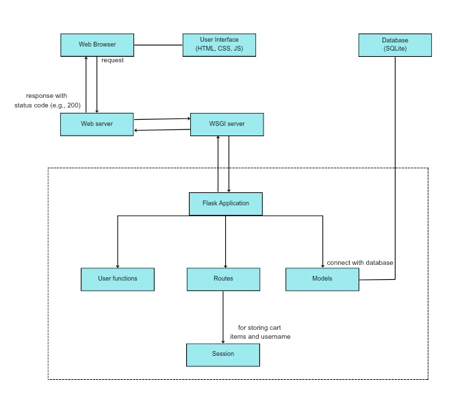

## Plant'em : An e-commerce application using Gen-AI
### 1. Details of the design: 
Here's a simplified information of the e-commerce application:
- User Interface (UI):
    - Homepage: Displays featured products, categories, and promotions.
    - Product Pages: Show detailed information about individual products, including images  descriptions, and pricing.
    - Shopping Cart: Allows users to view and manage items they've added to their cart.
    - Checkout: Collects user information, shipping details, and payment information for completing orders.
    - Login and signup functionality: register the user and login it. IT further have functionality to authenticate using OTP. By default for demonstration purposes the OTP is set to '1234'

- Frontend Components:
    - HTML Templates: Define the structure and layout of web pages.
    - CSS Stylesheets: Provide styling and visual design for UI elements.
    - JavaScript: Enables client-side interactivity, form validation, and dynamic content updates.

- Backend Components:
    - Flask Application: Acts as the backend server, handling HTTP requests and generating responses.
    - Flask Routes: Define the logic for handling different URL paths and HTTP methods.
    - Data Models: Represent entities such as products, users, orders, and cart items. Database (e.g., SQLite): Stores application data, including product information, user accounts, and order history.

### 2. Features: 
- User Authentication and Authorization:
    - Authentication: Allows users to sign up, log in, and manage their accounts.
    - Authorization: Restricts access to certain pages and functionality based on user roles and permissions.

- Shopping Cart Functionality:
    - Add to Cart: Enables users to add items to their shopping cart while browsing products.
    - Persist Cart State: Stores cart data in the database or session to maintain state across sessions.

- Order Processing:
    - Place Order: Allows users to complete their purchase by providing shipping and payment information.

### 3. Architecture: 
Below is the simple architecture diagram on how application works. 


### 4. Creating table:
To create tables: Users and Products:
```
import sqlite3
conn = sqlite3.connect("users.db")
cur = conn.cursor()
cur.execute("create table users(id integer PRIMARY KEY AUTOINCREMENT, uname text, mobile integer(10), email text, password text)")
conn = sqlite3.connect("products.db")
cur = conn.cursor()
cur.execute("create table products(id INTEGER PRIMARY KEY AUTOINCREMENT,name TEXT NOT NULL, price REAL NOT NULL,image TEXT NOT NULL)")
```
